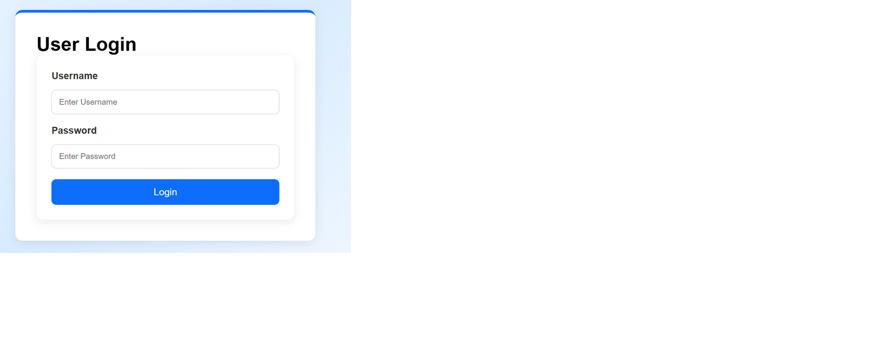
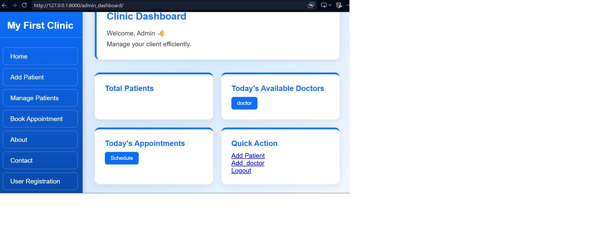
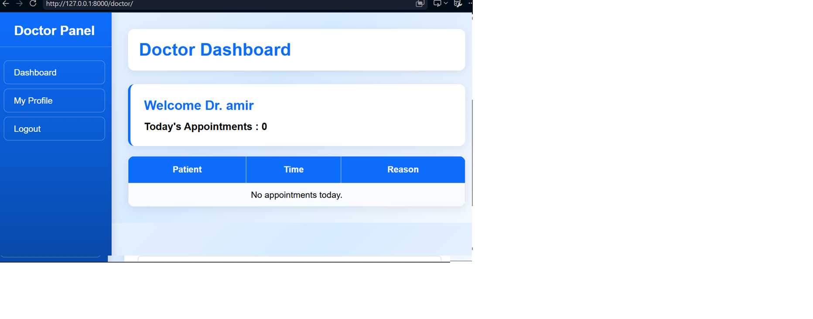
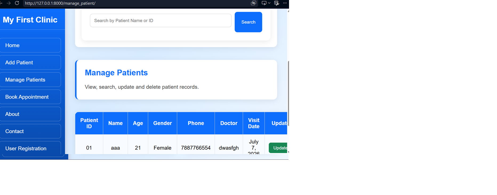
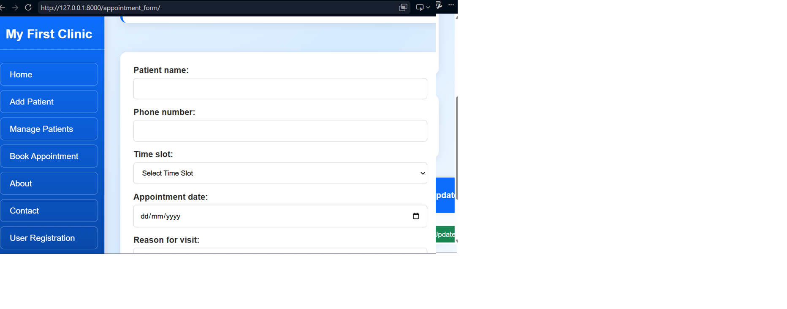

# 🏥 Clinic Management System

A web-based **Clinic Management System** built with **Python, Django, HTML, CSS, and SQLite**. This application helps clinics efficiently manage patients, doctors, appointments, and user roles through a secure and user-friendly interface.

---

## ✨ Features

### 🔐 Authentication & Authorization

* User Registration
* Secure Password Hashing
* Secure Login
* Session-Based Authentication
* Role-Based Login

  * Admin
  * Doctor
  * Receptionist
* Welcome Email After Successful Registration
* Logout Functionality
* Login Protection

---

### 👨‍⚕️ Doctor Management

* Add New Doctor
* Store Doctor Information
* Doctor Profile Details
* Doctor Schedule Management
* Doctor Selection During Appointment Booking

---

### 🧑 Patient Management

* Add Patient
* Update Patient Information
* Delete Patient
* View Patient Records
* Auto-Generated Patient ID
* Search Patient by Name
* Search Patient by Patient ID
* Pagination for Patient Records
* Success Messages After CRUD Operations

---

### 📅 Appointment Management

* Book Appointment
* Assign Doctor
* Select Appointment Date
* Select Time Slot
* Reason for Visit
* Appointment Confirmation Message

---

### 📊 Role-Based Dashboards

#### 👨‍💼 Admin Dashboard

* View Total Patients
* View Total Doctors
* View Total Appointments
* Manage Patients
* Manage Doctors
* Manage Appointments

#### 👨‍⚕️ Doctor Dashboard

* View Today's Appointments
* View Assigned Patients

#### 🧑‍💼 Reception Dashboard

* Add Patients
* Book Appointments
* Manage Daily Clinic Operations

---

### 📄 Reports

* Export Patient Records to PDF
* Export Patient Records to CSV

---

### 🔍 Search & Navigation

* Search Patients
* Pagination
* Dynamic Sidebar Based on User Role

---

### 🎨 User Interface

* Modern Dashboard Design
* Separate Dashboards for Admin, Doctor and Receptionist
* Clean Forms
* Custom CSS Styling
* Success & Error Messages

---

## 🛠️ Technologies Used

* Python
* Django
* HTML5
* CSS3
* SQLite3
* Pillow
* SMTP (Email Integration)

---

## 📂 Project Structure

```text
HEALTHCARE PROJECT/
├── clinicproject/
│   ├── clinicproject/
│   ├── Patientrecordsystem/
│   ├── doctors/
│   ├── manage.py
│   ├── db.sqlite3
│   └── .gitignore
├── README.md
└── requirements.txt
```

---

## 🚀 Installation

### Clone the repository

```bash
git clone https://github.com/Shazia-Rahman/clinic_management_system_django.git
```

### Go to the project folder

```bash
cd clinicproject
```

### Install dependencies

```bash
pip install -r requirements.txt
```

### Apply migrations

```bash
python manage.py migrate
```

### Run the development server

```bash
python manage.py runserver
```

Open your browser and visit:

```
http://127.0.0.1:8000/
```

---

## 📸 Screenshots

### 🔐 Login Page



---

### 📊 Admin Dashboard



---

### 👨‍⚕️ Doctor Dashboard



---

### 👥 Manage Patients



---

### 📅 Book Appointment



---

## 🔮 Future Enhancements

* Doctor Schedule Availability
* Slot Booking Validation
* Prescription Module
* Billing & Invoice Generation
* Patient Medical History
* Email Appointment Reminder
* Analytics Dashboard
* Online Payment Integration
* Django REST API Integration
*AI Chatbot Integration

---

## 👩‍💻 Developed By

**Shazia Rahman**

Python & Django Developer

This project was developed as a real-world Clinic Management System for small clinics and hospitals to simplify patient management, doctor management, appointment scheduling, and daily clinic operations.

---

## Support

If you found this project useful, please consider giving it a ⭐ on GitHub.
